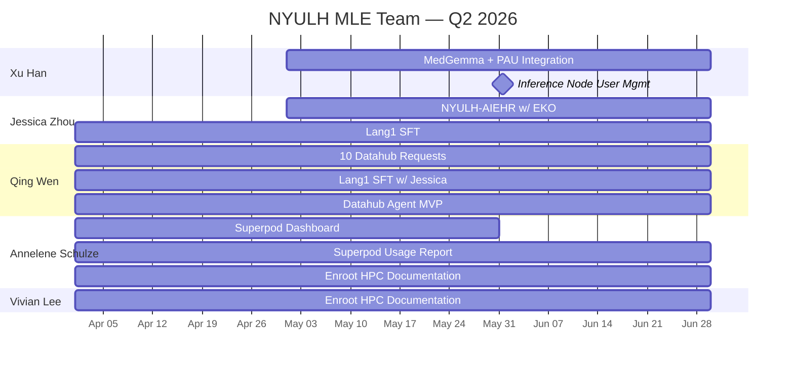

# Q2 2026 Timeline

**Quarter:** April 1 – June 30, 2026 · Back to [[MAIN Dashboard|Dashboard]]

---

## Gantt Chart

---

## Milestones

| Done | Milestone | Project | Owner(s) | Due |
|:---:|---|---|---|---|
| [ ] | Inference Node User Mgmt | [[inference-node-user-management\|→]] | [[xu-han\|Xu Han]] | 2026-05-31 |
| [ ] | Superpod Dashboard | [[superpod-dashboard\|→]] | [[annelene-schulze\|Annelene Schulze]] | 2026-05-31 |
| [ ] | MedGemma + PAU Integration | [[medgemma-deployment\|→]] | [[xu-han\|Xu Han]] | 2026-06-30 |
| [ ] | NYULH-AIEHR built out | [[nyulh-aiehr\|→]] | [[jessica-zhou\|Jessica Zhou]] | 2026-06-30 |
| [ ] | 10 Datahub Requests | [[neuro-data-hub\|→]] | [[qing-wen\|Qing Wen]] | 2026-06-30 |
| [ ] | Lang1 SFT complete | [[lang1-finetune\|→]] | [[jessica-zhou\|Jessica Zhou]], [[qing-wen\|Qing Wen]] | 2026-06-30 |
| [ ] | Datahub Agent MVP | [[datahub-agent\|→]] | [[qing-wen\|Qing Wen]] | 2026-06-30 |
| [ ] | Enroot HPC Docs finalized | [[enroot-guide-dissemination\|→]] | [[annelene-schulze\|Annelene Schulze]], [[vivian-lee\|Vivian Lee]] | 2026-06-30 |
| [ ] | Superpod Usage Report | [[superpod-dashboard\|→]] | [[annelene-schulze\|Annelene Schulze]] | 2026-06-30 |
